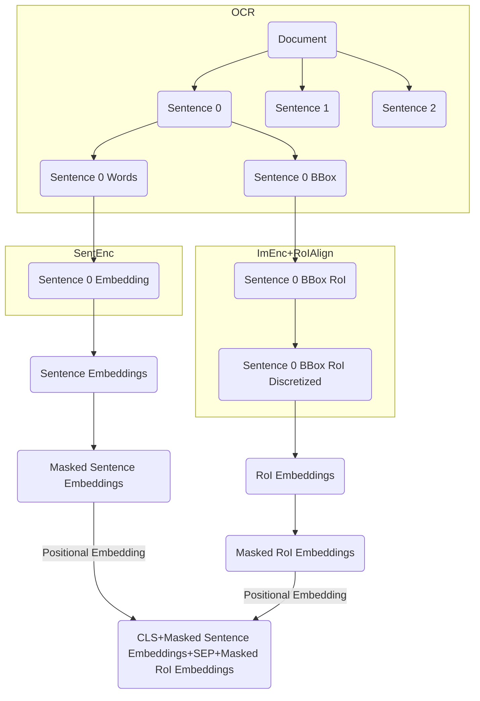

```mermaid
graph TD
%% Document
id1(Document)

%% Sentences
id2.1(Sentence 0)
id2.2(Sentence 1)
id2.3(Sentence 2)

%% Words
id3.1(Sentence 0 BBox)
id3.2(Sentence 0 Words)

%% ROI
id4.1(Sentence 0 BBox RoI)

%% Sentence Embedding
id5.1(Sentence 0 Embedding)

%% ROI Discret
id6.1(Sentence 0 BBox RoI Discretized)

%% Masked
id7.1(Sentence Embeddings)
id7.2(RoI Embeddings)
id8.1(Masked Sentence Embeddings)
id8.2(Masked RoI Embeddings)

%% Input
id9.1(CLS+Masked Sentence Embeddings+SEP+Masked RoI Embeddings)

subgraph OCR
	id1 --> id2.1 & id2.2 & id2.3
	id2.1 --> id3.1 & id3.2
end

subgraph ImEnc+RoIAlign
	id3.1 --> id4.1
	id4.1 --> id6.1
end

subgraph SentEnc
	id3.2 --> id5.1
end

id5.1 --> id7.1 --> id8.1 -- Positional Embedding --> id9.1
id6.1 --> id7.2 --> id8.2 -- Positional Embedding --> id9.1

```