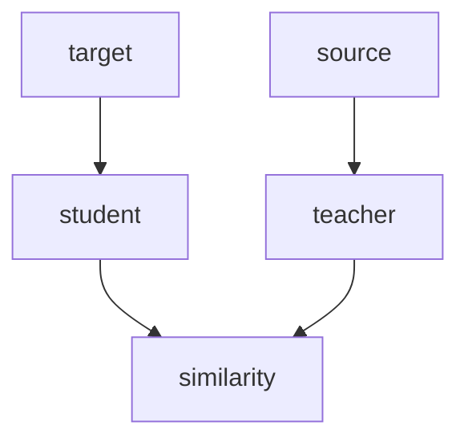

---
aliases:
- Multilingual Embedding Alignment with Distillation
created: '2022-07-09'
date: '2022-07-09'
modified: '2022-07-09'
references: null
tags: []
title: Multilingual Embedding Alignment with Distillation
---

# Multilingual Embedding Alignment with Distillation

Highlights: [[highlights/Archive/Xiong et al. - 2022 - Simple Local Attentions Remain Competitive for Lon.textbundle/text]]

## Distillation Architecture

Target and source input can be the same text or parallel text. The student network can have different vocabulary from the teacher network.

## Why Distillation

Training a monolithic dense model for many languages is expensive and cumbersome due to computation cost. Instead, training one small model for each language family or even a single language allows more flexibility to 1) add new languages, 2) support different vocabularies, and 3) tune performance separately.

## How to Distill

1. Use [[20220709205943|Margin-based Cosine Similarity Metric]] to align teacher embeddings and student embeddings.
2. Add *Masked Language Modeling objective* as well to encourage the model to learn from the monolingual data as well.
3. Allow curriculum learning via progressive distillation — sentence pairs are fed incrementally at a 10% interval.
4. Use max-pooling instead of `CLS` embedding.