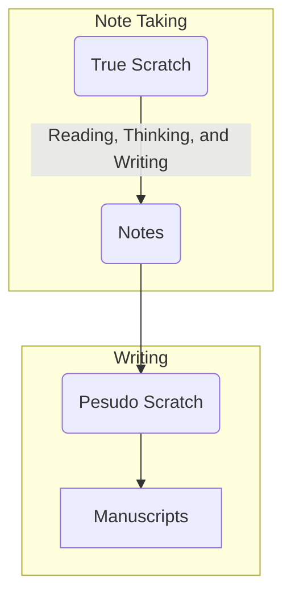

---
aliases:
  - Starting From Scratch
  - "Starting from Scratch"
linter-yaml-title-alias: Starting From Scratch
order: -20220717122151
tags: 
title: Starting From Scratch
---

# Starting From Scratch

A blank paper or a white screen is never the starting point of a writing project. To decide on a topic to write about, one must have some exposure to the topic before.

**Having a slip-box thus is the key difference between scavenging your brain for ideas with fuzzy memories and using an external system that is reliable and objective with accurate and interesting notes.**

As a result, writing should never to top-down and brain-driven. Instead, it should bottom-up and evident-based. *You should make decisions such as which topic to write about based on your notes, written ideas and thoughts because you already have the materials in the notes.*

This is also why we should [[20220823071945|Resist Brainstorming]] because we now can turn to our slip box for time-tested ideas.
